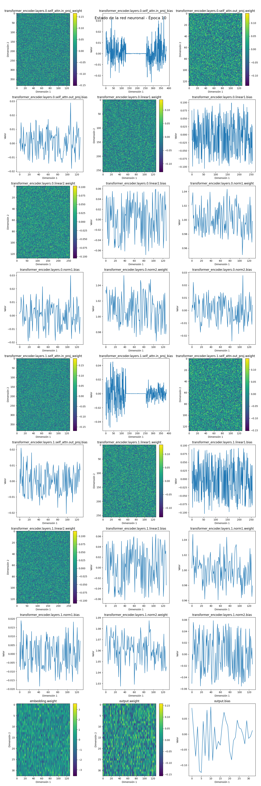
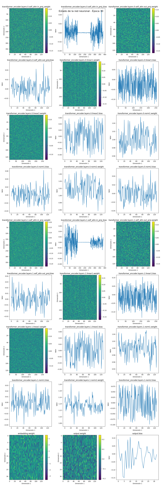
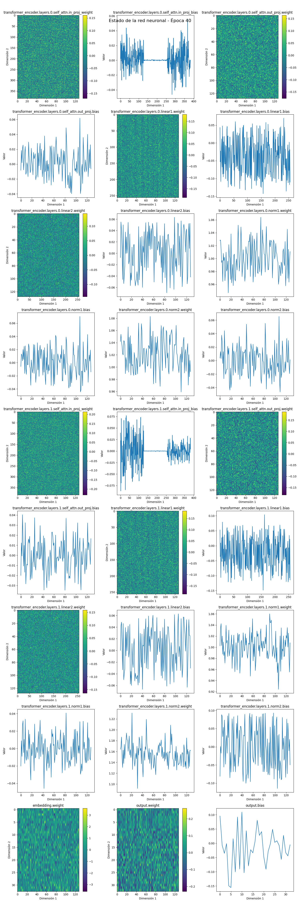
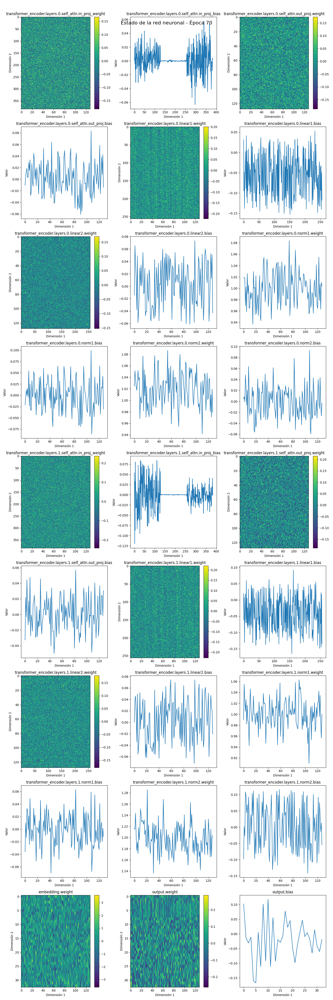

# Simple LLM Project

This repository contains a basic implementation of a Language Model (LLM) using PyTorch. The project aims to demonstrate the fundamental components of an LLM at a low level, serving as an educational resource for understanding the architecture and training process of such models.

## Project Overview

The main script `LLM.py` implements a simple Transformer-based language model trained on a small dataset of Spanish proverbs. Key features include:

- Positional Encoding
- Transformer architecture with self-attention and feed-forward layers
- Custom dataset for proverbs
- Training loop with visualization of model parameters
- Text generation functionality

## Requirements

To run this project, you'll need:

```
torch
matplotlib
networkx
```

You can install these dependencies using the provided `requirements.txt` file:

```
pip install -r requirements.txt
```

## Usage

1. Clone the repository
2. Install the required dependencies
3. Run the main script:

```
python LLM.py
```

The script will train the model on the provided dataset and generate new proverbs based on the trained model.

## Project Structure

- `LLM.py`: Main script containing the model implementation, training loop, and text generation
- `parameters.txt`: Detailed breakdown of model parameters
- `table.txt`: Token probabilities during text generation
- `requirements.txt`: List of required Python packages
- `epoch_*.png`: Visualizations of model parameters at different training epochs

## Model Architecture

The model uses a Transformer architecture with the following components:

- Embedding layer
- Positional encoding
- Multi-head self-attention
- Feed-forward neural network
- Output linear layer

## Training Visualization

The training process is visualized through a series of images (epoch_10.png to epoch_100.png) showing the state of the neural network at different epochs. These visualizations provide insights into how the model parameters evolve during training.

## Results

After training, the model attempts to generate new proverbs based on the learned patterns. The generated text and token probabilities are saved in `table.txt` for analysis.

## Limitations and Future Work

This implementation is a simplified version of an LLM and is not suitable for practical applications. It serves primarily as an educational tool. Future work could include:

- Scaling up the model size and dataset
- Implementing more advanced training techniques
- Adding support for different languages or domains

## Visualizations

Here are the visualizations of the model's state at different epochs during training:










These images show how the model parameters evolve over the course of training, providing insight into the learning process of the language model.
