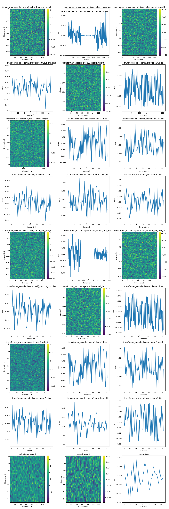
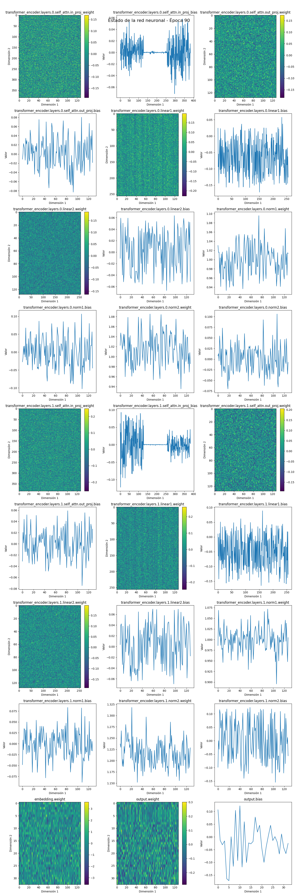
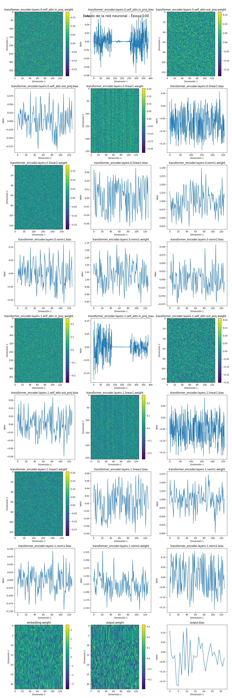

# Proyecto basico de (LLM)

Este repositorio contiene una implementación básica de un Modelo de Lenguaje (LLM) utilizando PyTorch. El proyecto tiene como objetivo demostrar los componentes fundamentales de un LLM a bajo nivel, sirviendo como recurso educativo para comprender la arquitectura y el proceso de entrenamiento de estos modelos.

## Visión General del Proyecto

El script principal `LLM.py` implementa un modelo de lenguaje simple basado en la arquitectura Transformer, entrenado en un pequeño conjunto de datos de refranes españoles. 

## Requisitos

Para ejecutar este proyecto, necesitarás:

```
torch
matplotlib
networkx
```

Puedes instalar estas dependencias usando el archivo `requirements.txt` proporcionado:

```
pip install -r requirements.txt
```

## Uso

1. Clona el repositorio
2. Instala las dependencias requeridas
3. Ejecuta el script principal:

```
python LLM.py
```

El script entrenará el modelo con el conjunto de datos proporcionado y generará nuevos refranes basados en el modelo entrenado.

## Estructura del Proyecto

- `LLM.py`: Script principal que contiene la implementación del modelo, el bucle de entrenamiento y la generación de texto
- `parameters.txt`: Desglose detallado de los parámetros del modelo
- `table.txt`: Probabilidades de tokens durante la generación de texto
- `requirements.txt`: Lista de paquetes Python requeridos
- `epoch_*.png`: Visualizaciones de los parámetros del modelo en diferentes épocas de entrenamiento

## Arquitectura del Modelo

El modelo utiliza una arquitectura Transformer con los siguientes componentes:

### 1. Capa de Embedding
- **Función**: Convierte los tokens de entrada (en este caso, caracteres) en vectores densos.
- **Funcionamiento**: Cada token se mapea a un vector de dimensión fija. Estos vectores se aprenden durante el entrenamiento.
- **Importancia**: Permite al modelo trabajar con representaciones continuas de los tokens, capturando relaciones semánticas entre ellos.

### 2. Codificación Posicional
- **Función**: Añade información sobre la posición de cada token en la secuencia.
- **Funcionamiento**: Utiliza funciones sinusoidales para generar vectores únicos para cada posición. Estos se suman a los embeddings.
- **Importancia**: Permite al modelo distinguir entre tokens idénticos en diferentes posiciones de la secuencia.

### 3. Capas de Codificador del Transformer
Cada capa del codificador contiene dos sub-capas principales:

#### a. Atención Multi-Cabeza
- **Función**: Permite al modelo atender a diferentes partes de la secuencia de entrada simultáneamente.
- **Funcionamiento**: 
  1. Proyecta los vectores de entrada en espacios de consulta, clave y valor.
  2. Calcula puntuaciones de atención entre todas las posiciones.
  3. Aplica una función softmax para obtener pesos de atención.
  4. Combina los valores ponderados por estos pesos.
- **Importancia**: Captura relaciones de largo alcance en la secuencia de entrada.

#### b. Red Neuronal Feed-Forward
- **Función**: Procesa la salida de la capa de atención.
- **Funcionamiento**: Consiste en dos transformaciones lineales con una activación ReLU entre ellas.
- **Importancia**: Introduce no-linealidad y aumenta la capacidad de representación del modelo.

### 4. Capa de Salida Lineal
- **Función**: Proyecta las representaciones finales a probabilidades sobre el vocabulario.
- **Funcionamiento**: Transforma los vectores de la última capa del codificador a la dimensión del vocabulario.
- **Importancia**: Permite al modelo generar predicciones sobre el siguiente token en la secuencia.

## Proceso de Entrenamiento

El entrenamiento se realiza utilizando:
- Pérdida de entropía cruzada como función de costo
- Optimizador Adam para actualizar los parámetros
- Técnica de "teacher forcing" donde se utilizan los tokens reales como entrada para predecir el siguiente token

Durante el entrenamiento, el modelo aprende a:
1. Representar eficientemente los tokens de entrada
2. Capturar dependencias contextuales en las secuencias
3. Generar predicciones precisas sobre los siguientes tokens

## Generación de Texto

Después del entrenamiento, el modelo puede generar nuevo texto:
1. Se proporciona un texto inicial como semilla
2. El modelo predice probabilidades para el siguiente token
3. Se selecciona un token basado en estas probabilidades (puede ser el más probable o usar muestreo)
4. El token seleccionado se añade a la secuencia y el proceso se repite

## Visualizaciones

Las imágenes `epoch_*.png` muestran el estado de los parámetros del modelo en diferentes épocas de entrenamiento. Estas visualizaciones proporcionan insights sobre cómo evolucionan los parámetros durante el aprendizaje.








Estas imágenes muestran cómo los parámetros del modelo evolucionan a lo largo del entrenamiento, proporcionando una visión del proceso de aprendizaje del modelo de lenguaje.
